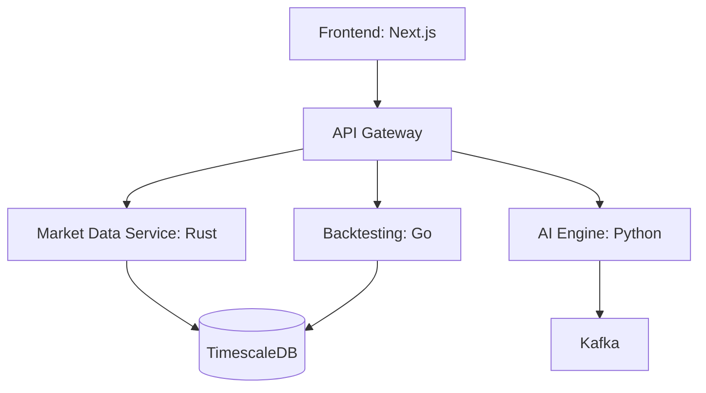

# zyumn.ai

Modern AI-powered trading platform combining real-time market analysis, strategy development, and backtesting capabilities. Built for traders and analysts seeking an edge through machine learning and natural language processing.

**Website:** [zyumn.ai.vercel.app](https://zyumn-ai.vercel.app)

<!--  -->

## Key Features

🚀 **Real-Time Analysis**
- Live market data visualization
- Pattern recognition
- Custom indicators
- Multi-timeframe analysis

🧠 **AI Trading Engine**
- LLM market research
- Sentiment analysis
- Automated signals
- Risk optimization

📊 **Advanced Backtesting**
- Strategy simulation
- Performance metrics
- Cost analysis
- Risk assessment

## Tech Stack



- **Frontend:** Next.js, TypeScript
- **Backend:** Rust, Python, Go
- **Data:** TimescaleDB, Kafka, Redis
- **Infrastructure:** Docker, Kubernetes

## Quick Start

```bash
git clone https://github.com/AmmarAlzureiqi/zyumn.ai
cd zyumn.ai
docker-compose up
```

Visit `http://localhost:3000` to access the platform.

<!-- ## Screenshots

| Dashboard | Strategy Builder | Backtesting |
|-----------|-----------------|-------------|
|  |  |  | -->

## Development Status

- ✅ Core architecture
- 🏗️ Market data integration
- 🏗️ AI strategy engine
- 🏗️ Backtesting system
- 📅 Advanced analytics (Planned)
- 📅 Mobile app (Planned)

<!-- ## Learn More -->

<!-- - [Documentation](docs/README.md) -->
<!-- - [API Reference](docs/api.md)
- [Contributing Guide](CONTRIBUTING.md) -->

## License

MIT © zyumn

---
Built with precision in Rust, intelligence in Python, and real-time capabilities in Go.